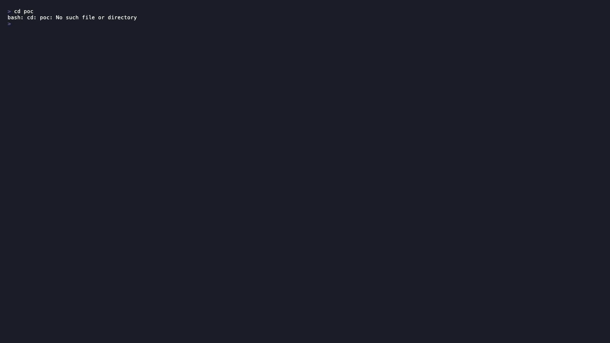

# Terminal Demo

A short terminal recording explains the **plan → vote → build → review → adopt**
flow faster than static diagrams. The recording is scripted with
[VHS](https://github.com/charmbracelet/vhs) so it stays reproducible: the script
is committed to the repo and anyone can regenerate the recording from source.

## Broadcasting To Every Agent

The simplest thing council does is fan a single prompt out to every agent pane
at once: type in the composer, press `Enter`, and all agents receive it
simultaneously.

<p align="center">
  
</p>

## The Full Orchestration Run

The full run drives **plan → vote → build → review → adopt** end to end against
the playground in `poc/`.

<p align="center">
  
</p>

The recording is generated locally from the committed tape (below), because it
requires live agent CLIs to produce.

## What The Demo Shows

The tape runs a complete council workflow inside the self-contained playground
in `poc/`. It `cd`s into `poc/` first, so council loads the
playground's own (locally git-excluded) `poc/.council.yaml` and `@TASK.md`
resolves to `poc/TASK.md` — the "Build a Local-First Dependency Kanban" task.
`poc` enables two agents, `claude` and `codex` (each acting as both worker and
reviewer), and the tape drives them through every phase:

```text
/plan @TASK.md      # both agents draft a plan from poc/TASK.md
/vote               # reviewers rank the anonymized plans; a winner is tallied
/build              # stage one git worktree per worker (no prompt sent yet)
/start-build        # send the build prompt; agents implement the winning plan
/review             # run poc's check_command, drop failures, rank the diffs
/adopt              # preview the winning diff and apply it (press y)
```

## It Self-Paces With `Wait`, Not Fixed Sleeps

A live run is driven by real agent CLIs doing real work, so phase durations vary
wildly from machine to machine. Rather than guessing with fixed `Sleep`s, the
tape uses VHS [`Wait+Screen`](https://github.com/charmbracelet/vhs#wait) to block
until a stable marker that council actually prints on screen for each phase —
the status-line text such as `collected N plan(s)`, `winner: …`,
`ready in worktrees`, `best build: …`, and `uncommitted`. Each `Wait` carries
a generous
`@timeout` that is a **safety ceiling, not the expected duration**; if a slow run
trips one, raise that ceiling rather than shortening it.

There is one exception. council emits no "build complete" marker — build
completion is user-judged (the HUD only hints `Next: /review when done`) and the
agent CLIs stay interactive instead of exiting — so the build-work step falls
back to a single, clearly-commented `Sleep` in the tape. That `Sleep` is
approximate and is the long pole of the recording; tune it to your
hardware/agents/models.

Because real runs are minutes long (build most of all), the resulting recording
is long. The tape writes a `.gif` so it embeds inline in the README and these
docs with plain Markdown image syntax. To tighten it for sharing you can:

- Lower the fallback build `Sleep` and the `@timeout` ceilings to match your
  machine once you know how long a run actually takes.
- Add `Set PlaybackSpeed 2` (or higher) near the top of the tape to play the
  recording back faster without re-running the agents.
- Trim or split the output afterwards, or change the `Output` line to `.mp4` /
  `.webm` for a different format.

## Regenerating The Recording

The tape lives at [`council-demo.tape`](assets/council-demo.tape) and writes its
output to `docs/assets/council-demo.gif`.

1. **Install VHS** — `brew install vhs`, or see the
   [VHS install guide](https://github.com/charmbracelet/vhs#installation).
2. **Put `council` on your PATH** — for example
   `go build -o bin/council ./cmd/council` and add `bin/` to `PATH`, or
   `brew install umutarmut38/council/council`.
3. **Install and authenticate the agent CLIs** — the playground enables
   `claude` and `codex`, so both must be installed and logged in. (Optionally,
   poc can route them through a local headroom proxy by setting
   `experimental.setup_env: true` in `poc/.council.yaml`; by default the proxy
   does not start and the agents run directly.)
4. **Trust the playground config once** — `poc/.council.yaml` is a repo-local
   config, so run `council trust` inside `poc/` (or the first launch will stop
   to ask). The tape assumes it is already trusted.
5. **Record from the repo root** — the tape `cd`s into `poc/` itself, so run it
   from the council repo root:

   ```bash
   vhs docs/assets/council-demo.tape
   ```

This produces `docs/assets/council-demo.gif`. To preview without writing a file,
use `vhs --publish docs/assets/council-demo.tape`, or change the `Output` line in
the tape to `.mp4`/`.webm`/`.txt` for a different format.

The `Wait` timeouts in the tape are safety ceilings; the one fixed `Sleep`
(build work) is approximate. Tune both to your machine and agents so each phase
finishes before the next command is typed.
