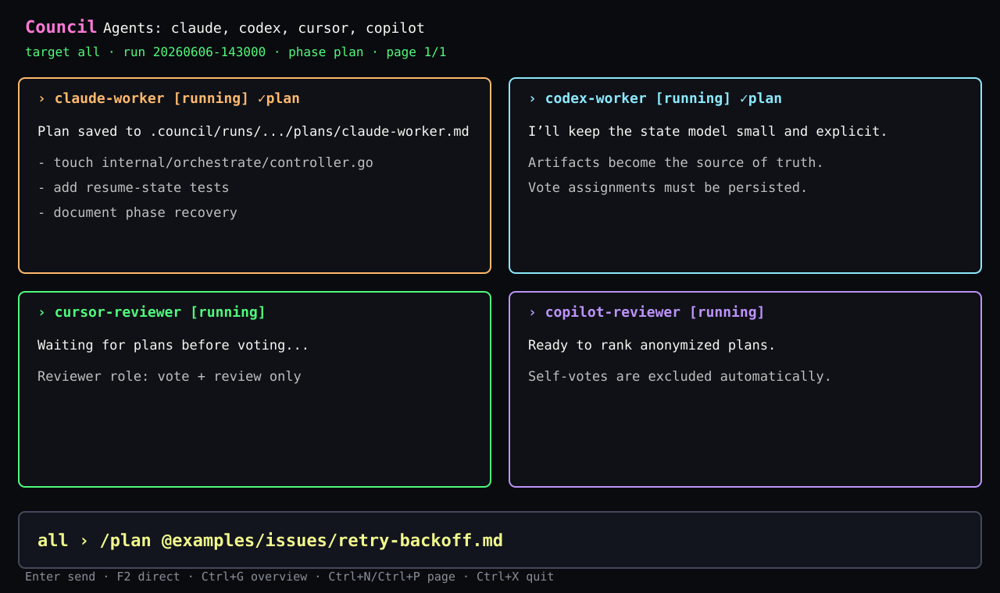
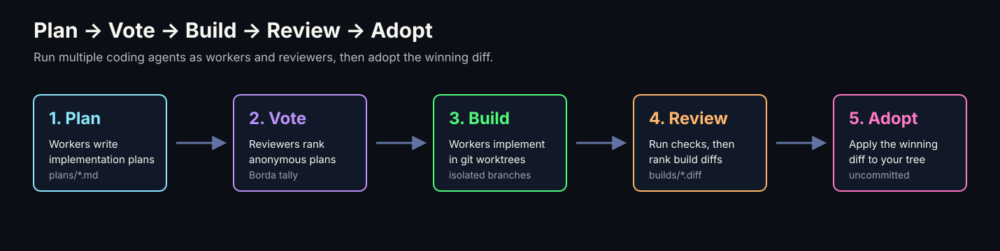
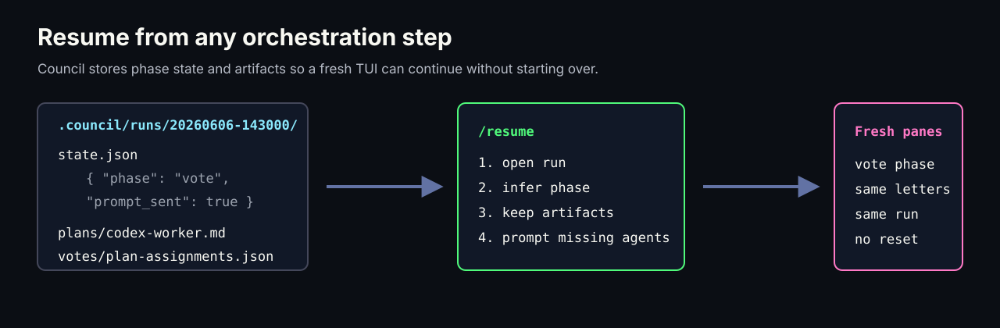

# council

`council` is a terminal workbench for running multiple AI coding agents at once.
It gives each agent a live PTY pane, lets you broadcast or direct prompts, and
can orchestrate a plan → vote → build → review → adopt workflow.



## Start Here

- [Commands](commands.md) — in-chat commands and CLI subcommands.
- [Shortcuts](shortcuts.md) — keyboard shortcuts for panes, pages, direct input,
  overview, settings, and run browsing.
- [Workflows](workflows.md) — multiplexer usage, council orchestration, roles,
  personalities, targeting, resume, and artifact locations.
- [Configuration](configuration.md) — full YAML reference for agents, terminal
  quirks, orchestration roles, personalities, and per-repo overrides.
- [Requirements](requirements.md) — supported platforms, build requirements,
  runtime requirements, and agent-specific notes.
- [Windows Support](windows.md) — what is supported, experimental, and only
  smoke-tested on Windows, plus recommended terminal and ConPTY limitations.
- [Architecture](architecture.md) — package layout, terminal model,
  orchestration model, and trust boundaries.
- [Troubleshooting](troubleshooting.md) — prompt delivery, rendering, folder
  trust, resume, and worktree cleanup.
- [Release Guide](release.md) — release checklist, artifacts, and tagging.

## Workflow



```text
/plan @examples/issues/retry-backoff.md
/vote
/build
/start-build
/review
/adopt
```

## Resume



Runs are stored under `.council/runs/<timestamp>/`. If the TUI is interrupted
inside `plan`, `vote`, `build`, or `review`, `/resume` relaunches fresh agent
processes into the same phase, keeps existing artifacts, and prompts only the
unfinished agents.

## Requirements

- Go 1.23+ to build from source.
- Git 2.35+ for worktrees and patch adoption.
- A terminal with Unicode and ANSI color support.
- One or more configured agent CLIs, such as Claude Code, OpenAI Codex, Cursor
  Agent, GitHub Copilot CLI, or opencode.

See the repository README for installation, release artifacts, and platform
support notes.
